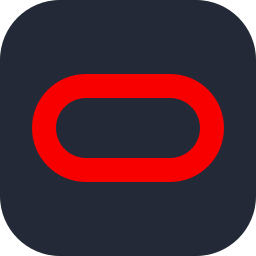

  

  
  
  
  

 

## 👨‍💻 Sobre Mim

Sou estudante de **Análise e Desenvolvimento de Sistemas** no **Instituto Federal de São Paulo** e trabalho como **Assistente de TI**. No dia a dia lido com suporte e infraestrutura, e nos estudos foco em desenvolvimento back-end, construindo APIs e aprendendo como sistemas funcionam por dentro. Acredito que a tecnologia pode tornar o mundo um lugar melhor, e quero fazer parte disso.

- 🔭 Atualmente desenvolvendo **APIs REST com Node.js e TypeScript**
- 🌱 Aprofundando em **TypeScript, Java, SQL e C**
- 💬 Pode falar comigo sobre **back-end, bancos de dados e suporte de TI**
- ⚡ Curto entender o "porquê" das coisas, não só o "como"

 

## 🛠️ Tech Stack

<table align="center">
  <thead>
    <tr>
      <th width="190" align="center">🎨 Front-End</th>
      <th width="190" align="center">⚙️ Back-End</th>
      <th width="190" align="center">🗄️ Banco de Dados</th>
      <th width="190" align="center">🧰 Ferramentas</th>
    </tr>
  </thead>
  <tbody>
    <tr>
      <td>&nbsp;&nbsp;<b>HTML5</b></td>
      <td>&nbsp;&nbsp;<b>TypeScript</b></td>
      <td>&nbsp;&nbsp;<b>MySQL</b></td>
      <td>&nbsp;&nbsp;<b>Node.js</b></td>
    </tr>
    <tr>
      <td>&nbsp;&nbsp;<b>CSS3</b></td>
      <td>&nbsp;&nbsp;<b>Java</b></td>
      <td>&nbsp;&nbsp;<b>Oracle</b></td>
      <td>&nbsp;&nbsp;<b>Git</b></td>
    </tr>
    <tr>
      <td>&nbsp;&nbsp;<b>JavaScript</b></td>
      <td>&nbsp;&nbsp;<b>PHP</b></td>
      <td></td>
      <td>&nbsp;&nbsp;<b>Postman</b></td>
    </tr>
    <tr>
      <td>&nbsp;&nbsp;<b>React</b></td>
      <td>&nbsp;&nbsp;<b>C</b></td>
      <td></td>
      <td>&nbsp;&nbsp;<b>VS Code</b></td>
    </tr>
    <tr>
      <td>&nbsp;&nbsp;<b>Angular</b></td>
      <td></td>
      <td></td>
      <td>&nbsp;&nbsp;<b>IntelliJ IDEA</b></td>
    </tr>
  </tbody>
</table>

 

## 🎓 Formação & Experiência

| | Instituição / Empresa | Função | Status |
| :---: | :--- | :--- | :---: |
| 🎓 | **Instituto Federal de São Paulo (IFSP)** | Tecnólogo em Análise e Desenvolvimento de Sistemas | 🟢 Cursando |
| 💼 | **Vidroeste Vidros** | Assistente de TI | 🟢 Atual |

 

## 📂 Projetos em Destaque

> ### 🚗 [API REST — Concessionária](https://github.com/Gustadev-7/projeto-I-prog-web)
> Sistema de gerenciamento de concessionária com rotas REST, desenvolvido com Node.js, Express e TypeScript e testado com Postman.
>
>   

> ### 🔜 Próximo projeto
> Em desenvolvimento. Fique de olho por aqui! 👀

 

## 📚 Cursos em Andamento

| | Curso | Instituição | Status |
| :---: | :--- | :--- | :---: |
|  | **UX/UI Design** |  | 🟡 Em andamento |
|  | **Java** |  | 🟡 Em andamento |

 

## 📊 Estatísticas

&nbsp;

 

## 🤝 Vamos nos conectar?

Estou sempre aberto a trocar ideias, colaborar em projetos ou conversar sobre tecnologia. Me chama em qualquer uma das redes abaixo!

  
  
  

 

⌨️ Feito com muito energético e curiosidade em Boituva/SP

